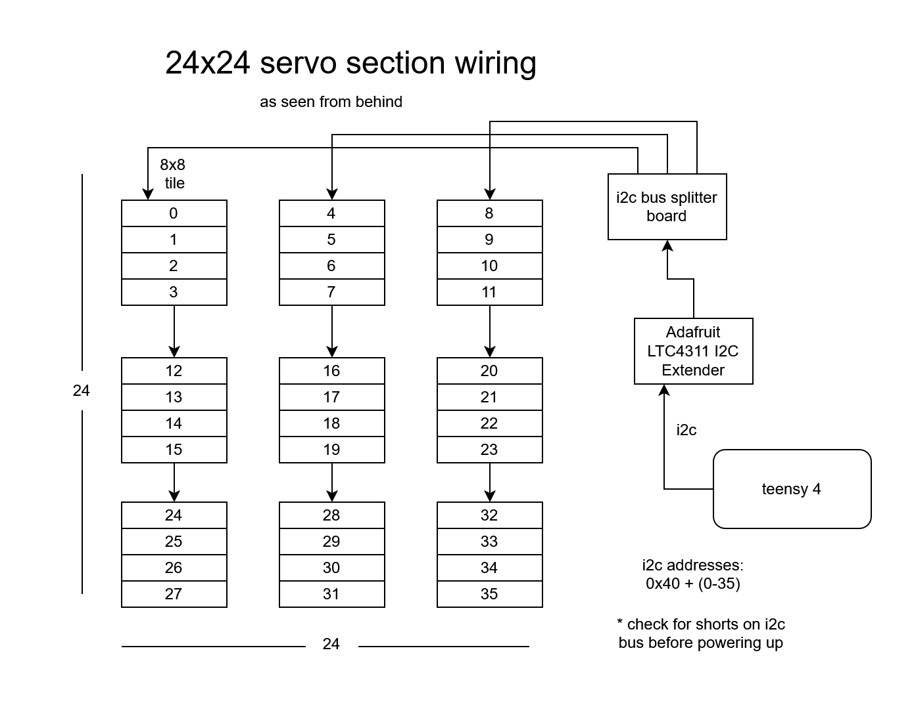

# MirrorWall Project

## Assembly Instructions
First assemble the Section Tile of 24x24 servos. Pay attention to the modules they each have a unique address that is configured by soldering the solder jumper pads on the board. Each `PCA9685` module controls 16 servos in a 8x2 configuration. The modules all need to be connected to the i2c bus. The physical connection order of the pwm modules does not matter because each module has a unique address. As long as the servos are in the correct output headers on the module. Typically the first thing connected to the i2c bus from the teensy4 is the adafruit i2c active termination module. This helps the i2c signl run longer and allow for lots of i2c devices to be connected.

- [ ] connect all the servos to the modules
- [ ] make sure the proper module order is maintained
- [ ] connect the power supply modules to the distribution terminals
- [ ] connect the power from distribution to the servo modules v+ and gnd green screw terminals 
- [ ] use a multimeter to check for shorts *before power on*
- - [ ] check between power v+ and ground
- - [ ] check between power and each of the i2c data lines
- - [ ] check for v+ and v- on all the power supplies
- - [ ] check v+ and earth ground / power supply chassie
- [ ] connect the rest of the power supplies a few at a time

Follow the layout to see how the i2c modules are connected.  When viewed from the back the order is as follows.
 of i2c wiring schematic

This is the relevant code in the `.\src\main.cpp` file to change if you need to alter the pwm module board layout. It it how the modules are when looking at the back of the section of 24x24 servos.
```cpp
uint8_t boardMap[12][3] = {
  {0, 4, 8},
  {1, 5, 9},
  {2, 6, 10},
  {3, 7, 11},
  {12, 16, 20},
  {13, 17, 21},
  {14, 18, 22},
  {15, 19, 23},
  {24, 28, 32},
  {25, 29, 33},
  {26, 30, 34},
  {27, 31, 35},
};
```

## installing new firmware
[Prerelease_01 firmware.hex](https://github.com/kuwala/MirrorWallMicro/releases/tag/Prerelease_01)
If you have a `.hex` file you can flash it onto the teensy4 using the [teensy loader software](https://www.pjrc.com/teensy/loader.html). Alternatively the firmware can be built using platformio in the project. You should also be able to use arduino and [teensyduino](https://www.pjrc.com/teensy/td_download.html) follow the guide on the teensy website to install teensyduino. Then copy the main.c file contents into a the source file for your new project. You may need to install some libraries.

## Setting up computer software
Download and install processing 4. The needed library should support intel mac cpus, definitively does support windows.

On windows you will need to install the [windows Intel RealSense SDK](https://github.com/realsenseai/librealsense/releases/tag/v2.53.1)

On MacOS (intel based) you can install [brew](https://brew.sh/) and use it to install the realsense sdk. [brew ilbrealsense](https://formulae.brew.sh/formula/librealsense)

Then you will need to install the `Intel RealSense for Processing 2.5.1 Florian Bruggisser` library. You do that by going to `sketch>import library>Management Libraries...` and search for `RealSense`. 

You can verify that it works by running on the included example sketch called `Align Streams` located in `File>Examples...>Contributed Libraries>Intel Realsense`.

## Using the system
To use the system you need to connect the teensy4 and the `Realsense Depth Camera D415` to the computer. Then open up the processing sketch located in the `.\processing\SerialAndRealSense`. It will crash if you have the camera not plugged in. Another thing to take note is what device the COM port is connected to. When the processing sketch is first run it will print out a list of Serial ports. 
On line `58` or so you will find the code `String portName = Serial.list()[0];` To change the serial port you need to change the number `0` on this line to the corresponding port that you see in the list of serial ports.

If a wrong serial port is used or a camera is not detected the program will freeze. You will need to alt tab and press the stop button in the processing ide window that you used to launch the sketch.

Make sure that the camera is using a USB 3 cable or it might not connect or drop connection.

Once the program is started press the Camera button (third one from the left) to turn it on. You should see a picture showing what the camera sees in addition to the pixel representation. There are a few options you can toggle on or off. When using the cooldown. (on by default) The red dot on a pixel will show up representing that that pixel is being supressed for some time.

## Adjust the camera
The intel Realsense SDK comes with a camera viewer application that can let you adjust camera settings. If you intend to make changes, I recommend First saving the current setings incase you want to return to them. Take note of the changes you make. You can turn on the camera preview by pressing on the camera toggle switch next to the camera name on the left panel of the window. Then there are values and sliders that can adjust various smoothing options. Some of these may be able to enhance the output.
[image](camera viewer)

## Servo Details:

### Old servo we tried
```
Previous SERVO
Miuzei 10 Pcs Sg90 9g Micro Servo Metal Gear servo motor kit

180 Degree Servo Motor Control Specification：

    Control system:Change the pulse width
    Amplifier type:Digital controller
    Operating travl:180° (500-2500 μsec)
    Left&Right travelling Angle deviation:≤ 6°
    Centering deviation:≤ 1°
    Neutral position:1500 μsec
    Dead band width:5 μsec
    Rotating direction:Counter Clockwise (500-2500μsec)
    Pulse width range:500-2500μsec
    Maximum travel:About 180° (500-2500 μsec)

    product:
    https://www.amazon.com/Micro-Helicopter-Airplane-Remote-Control/dp/B072V529YD
```

Some microsecond calculations
for 50hz servos
```bash
20000.00 us per period
4.88 us per bit
102400.00
20000.00 us per period
4.88 us per bit
512000.00
```
### Current SERVO in build
```md
Product Name: SG92R
Product size: 22.4x12.5x23.8mm
Product weight: 10 grams of earth 5%
Product line length: 25cm soil 1cm
Working voltage: 4.8V-6V
Blocking torque: 1.3KG.CM-1.8KG.CM
No-load speed: 0.09 sec/60
No-load current: 90MA
Output shaft: 20t

Product Description:Highlight：
High-quality copper wire
High quality nylon gears
High-speed strong magnetic motor

Kindly Reminder：
- Please use the standard pulse width modulation control signal, the period is 20ms, high level time 0.5~2.5ms
- 270 degrees and 180 degrees is the same, can stop at any angle, is adjustable angle
- 360 degrees is a continuous rotation, can not control the angle and speed
- 180 degrees and 270 degrees can control the angle, PWM 500-2500
- Can be remotely controlled 180 ° and 270 °
- If you need remote control, please contact customer service first

- Please use the standard pulse width modulation control signal, the period is 20ms, high level time 0.5~2.5ms 
```

